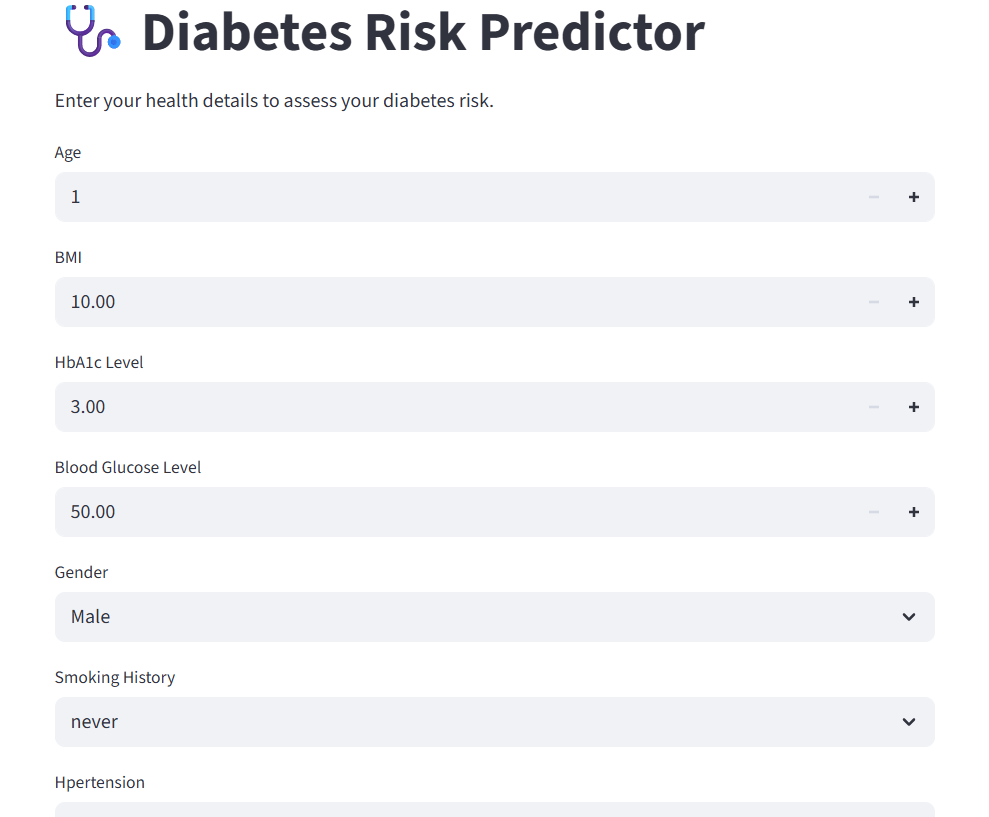
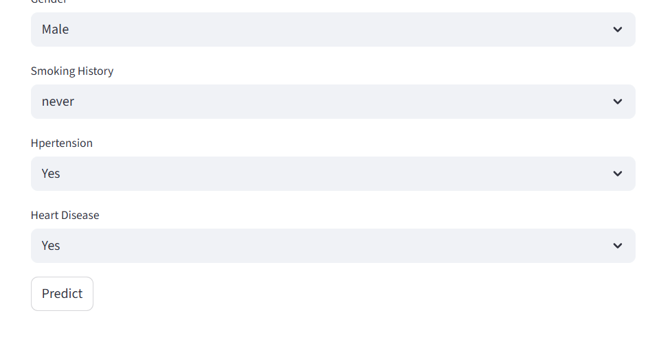
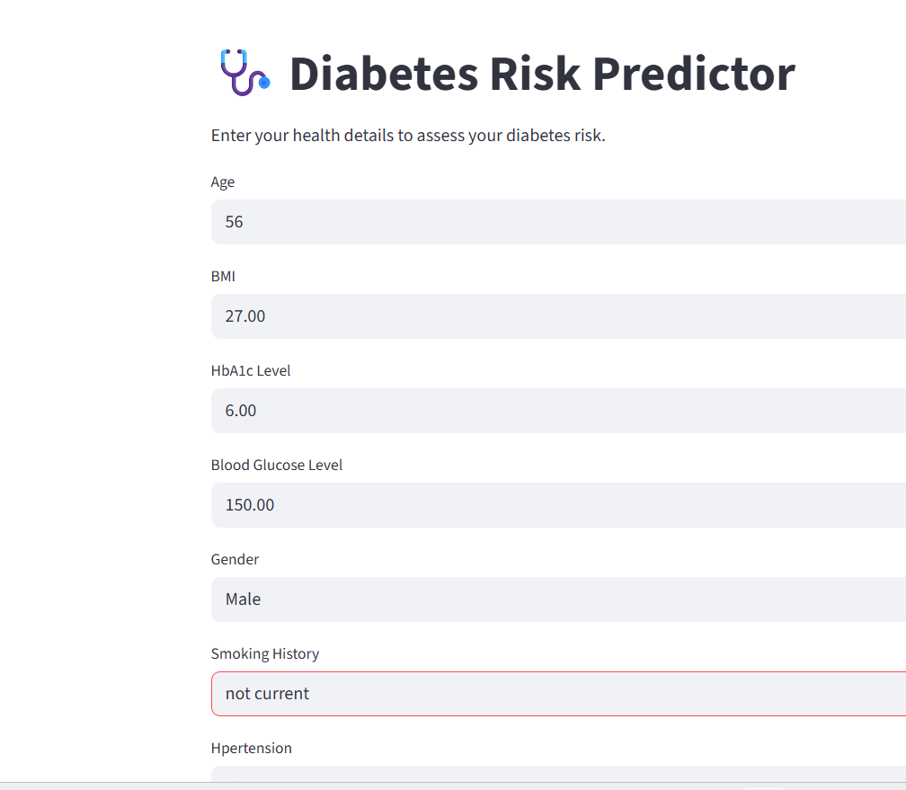
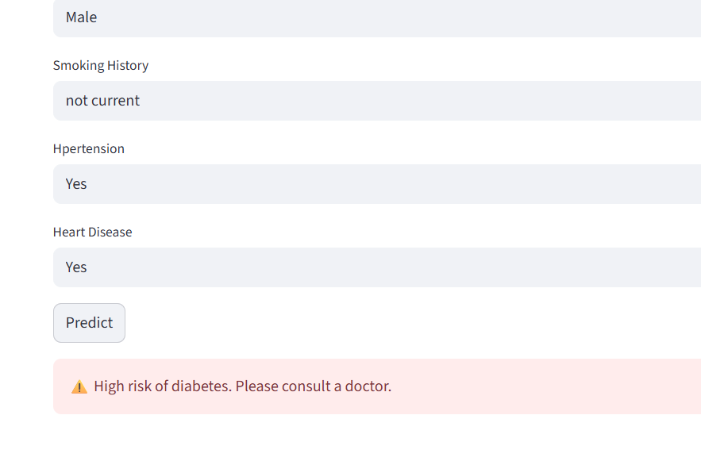
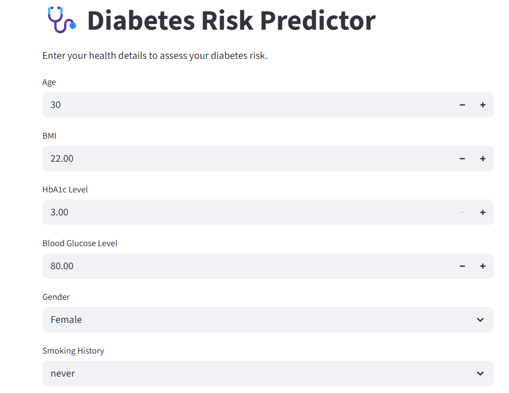
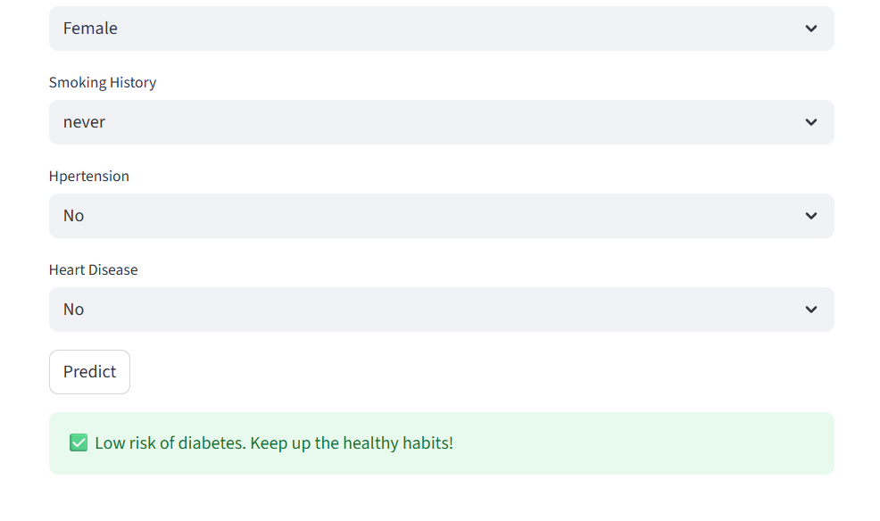

# 🩺 Diabetes Risk Predictor

A lightweight, interactive web app that predicts diabetes risk based on key health indicators using machine learning.

---

## 📷 Screenshots

### 🖥️ App Interface




### 📊 Prediction Results






---

## 🧠 Features

- Predicts diabetes risk using Random Forest, Logistic Regression, and Decision Tree models
- Clean Streamlit UI with dropdowns and number inputs
- Scaled inputs using `StandardScaler` for consistent predictions
- Encoded categorical features for gender and smoking history
- Organized folder structure for frontend/backend separation
- Ready for public deployment and open-source sharing

---

## 📦 Tech Stack

- Python  
- Scikit-learn  
- Streamlit  
- NumPy  
- Joblib

---

## 📁 Folder Structure

```
diabetes-prediction-app/ ├── backend/ │ ├── diabetes_model.pkl │ └── scaler.pkl ├── frontend/ │ └── app.py ├── notebooks/ │ └── model_training.ipynb ├── .venv/ ├── README.md
```

---

## 🧪 How to Run Locally

```bash
git clone https://github.com/your-username/diabetes-prediction-app.git
cd diabetes-prediction-app
python -m venv .venv
source .venv/bin/activate  # or .venv\Scripts\activate on Windows
pip install -r requirements.txt
streamlit run frontend/app.py

```
---
## 📊 Model Performance

| Model              | Accuracy (%) |
|--------------------|--------------|
| Logistic Regression| 95.90        |
| Random Forest      | **96.90** ✅ |
| Decision Tree      | 95.25        |

---

